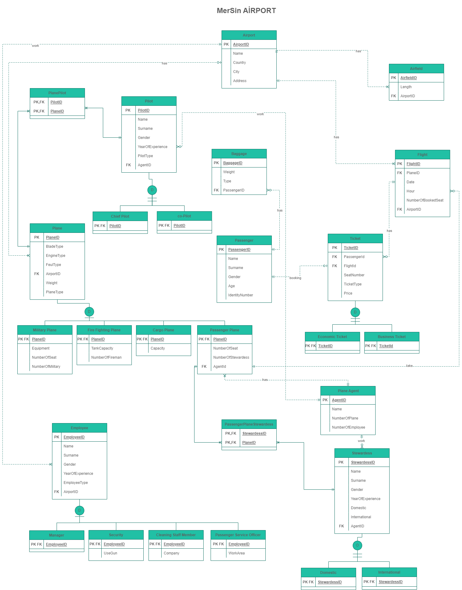

# Database  Management  System
### -MerSin  Airport-

The aim of this project is to establish an airport database, which is essential for effective **airport management**. By successfully creating this database, Mersin Airport can now be efficiently managed, ensuring smooth operations and eliminating any potential issues.

## Business  Rules

1.  Airport has name, address, country and city information. Each airport has different id  number.
2.  An airport must have at least one employee but there can also be more than one  employee.  An  employee  must  work  only  one  airport.
3.  Employee information should include name, surname, gender, and year of  experience.  Each  employee  has  different id  number.
4.  Employees can be a manager, security, cleaning staff member, passenger service  officer, or other personnel. But it can be only one of them. If an employee is a  security, used gun information should be kept, and if an employee is a passenger  service officer,  work  area  information should  also  be  kept.
5.  An airport has at least one airfield or more than one. An airfield must belong only  one airport.
6. Airfield  has  length  information.  Each  airfield  has  different  id  number.
7.  An airport has at least one plane or more than one. A plane must belong only one  airport or  none.
8.  Plane has blade type, engine type, weight and fuel type information. Each plane has  different id  number.
9.  Planes can be a passenger, cargo, military, firefighting or other type of planes. But it  can be only one of them. If a plane is a passenger plane; number of seat and number  of stewardess information should be kept. If a plane is a cargo plane; capacity  information should be kept. If a plane is a military plane; number of seats, equipment  and number of military information should be kept and if a plane is a firefighting  plane; tank  capacity  and  number  of  fireman information  should  also  be  kept.
10. A pilot can  fly  a  plane  or  many  plane.  A  plane can  be  flown  by  one  pilot  or  more  than  one  pilot.
11.  Pilot information should include name, surname, gender, and year of experience.  Each pilot  has  different  id  number.
12.  Pilots must be only one of the categories, chief or co-pilot. There can not be other  pilot  in  the  system.
13.  A  plane agent  can  have  no  pilot  or many  pilots.  A  pilot  must  work  for one  plane  agent.
14.  Plane  agent  has  name,  number  of  plane,  number  of employee  information.  Each  plane  agent  has  different  id  number.
15.  A stewardess can work for only one plane agent. A plane agents can have no  stewardess  or  many stewardesses.
16.  Stewardess information should include name, surname, gender, and year of  experience.  Each stewardess has  different  id number.
17.  In the system, a stewardess can exist in just two categories: a domestic and an  international.  A  stewardess can  also  be both.
18.  A stewardess can work a passenger plane or many passenger plane. A passenger  plane  can have  one  stewardess  or  more  than  one stewardess.
19.  A plane agent should have at least one passenger plane or more than one. A  passenger  plane  must  belong only  one  plane  agent.
20.  A passenger plane may not take a flight or may have more than one flight. A flight  can only  have  one passenger  plane.
21.  Flight information should include date, hour, and number of booked seat. Each flight  has  different  id  number.
22.  A flight should belong only one airport. An airport should have at least one flight or  more  than  one.
24.  A flight should belong only one passenger plane. A passenger plane can have no flight  or  many.
25.  A  flight can  have  no  ticket or  many  tickets.  A  ticket  can  only  belong one  flight.
26.  Ticket information should include seat number, price. Each ticket has different id  number.
27.  Tickets must be only one of the two categories, economic and business. There can  not  be  other  tickets  in  the  system.
28.  A  ticket  can  book  by  only  one  passenger,  a  passenger can  book  a  ticket  or  no  ticket.
29.  Passenger information should include name, surname, gender, age, and identity  number.  Each  passenger  has different id  number.
30.  A passenger can have no baggage or many baggage. A baggage should belong only  one  passenger.

31. Baggage information should include weight, and type. Each baggage has different id  number.
 

## Entity  Relationship Model

